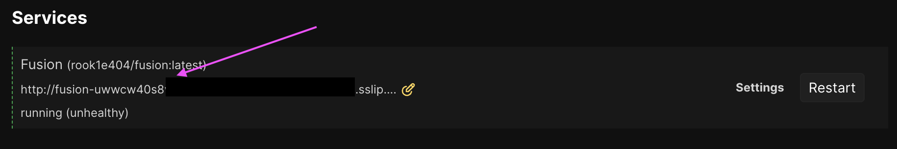
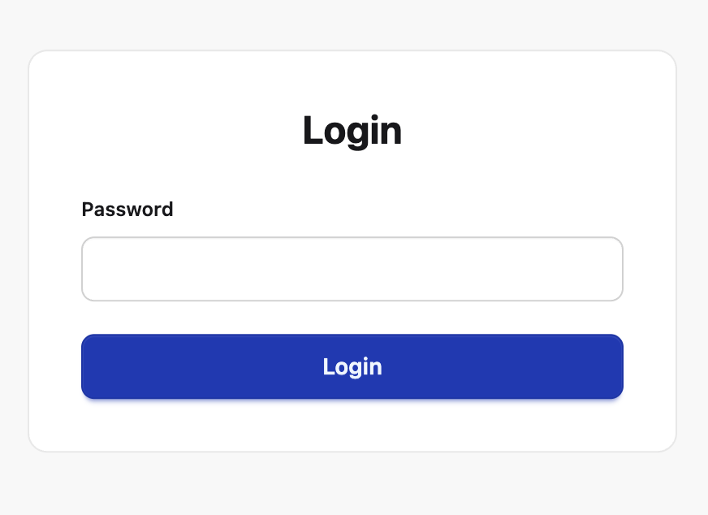

Here is how I set up [Fusion RSS reader](https://github.com/0x2E/fusion) on my [Coolify](https://coolify.io/):

(This assumes you already have Coolify installed, otherwise refer to the [installation docs](https://coolify.io/docs/get-started/installation))

0. Log on to your Coolify dashboard
1. Add a project
2. select production environment
3. Add new Resource
4. Select "Docker Compose Empty"
5. Add Docker Compose config:

```yaml
version: '3'
services:
  fusion:
    image: 'rook1e404/fusion:latest'
    ports:
      - '127.0.0.1:3000:8080'
    environment:
      # Password for the frontend (login)
      - PASSWORD=A_STRONG_PASSWORD
      # which path should be served on the fully qualified domain name?
      - SERVICE_FQDN_FUSION=/
      # which port (must map to the services.fusion.ports property)
      - SERVICE_FQDN_FUSION_3000
    restart: unless-stopped
    volumes:
      - './data:/data'
```

6. click "Deploy"
7. When deployed, the Services section should show the generated subdomain `<appname>.sslip.io`



Et voilà – you've got yourself a fusion instance deployed:


