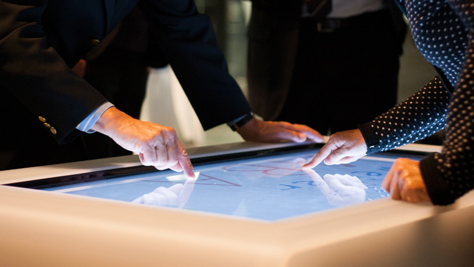
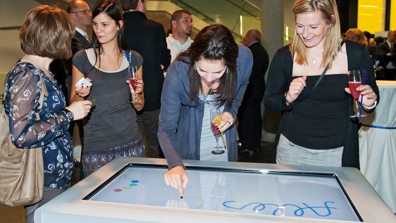
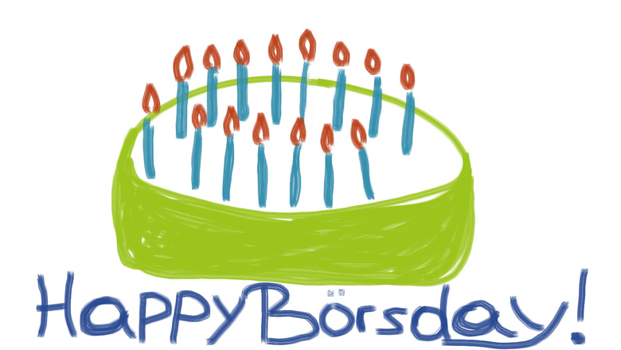
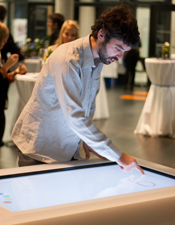
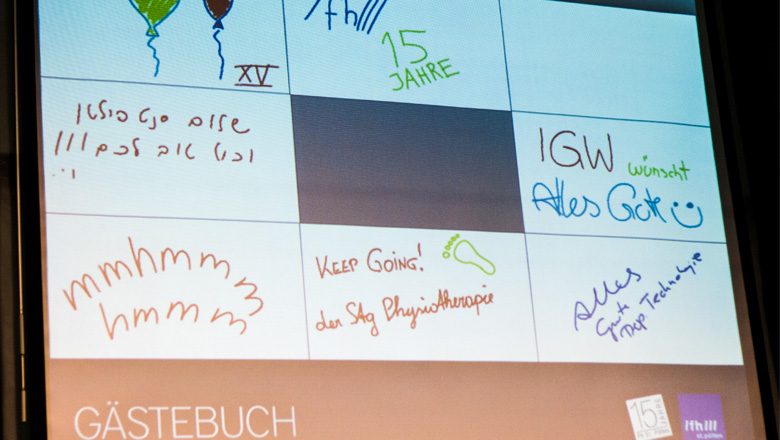
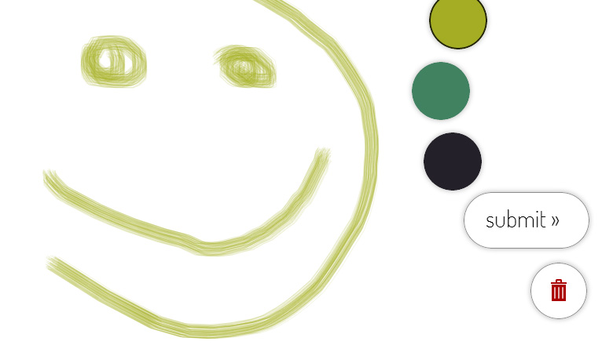
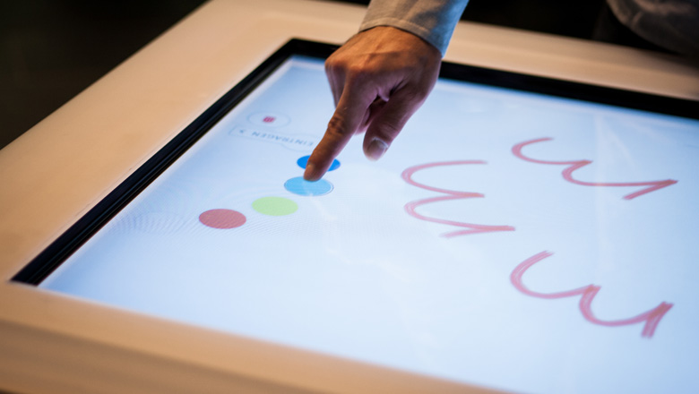
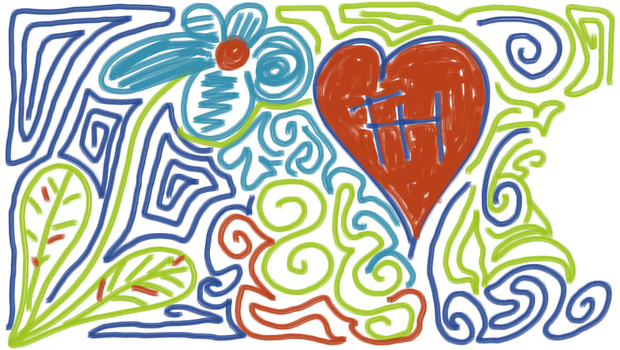

For the 15th anniversary of my university, St. Pölten University of Applied Sciences, I was commissioned to create a digital guest-book on a 46-inch multi-touch screen.

I developed a multi-touch drawing application using emerging and standard web-technologies. This was a great opportunity to examine the current state of multi-touch enabled web-applications.

Additionally, a large projection showed the eight most recent drawings on a large projection wall.

As a result of this project I wrote my master thesis on the possibilities of multi-touch-enabled web applications.

<!--  -->

