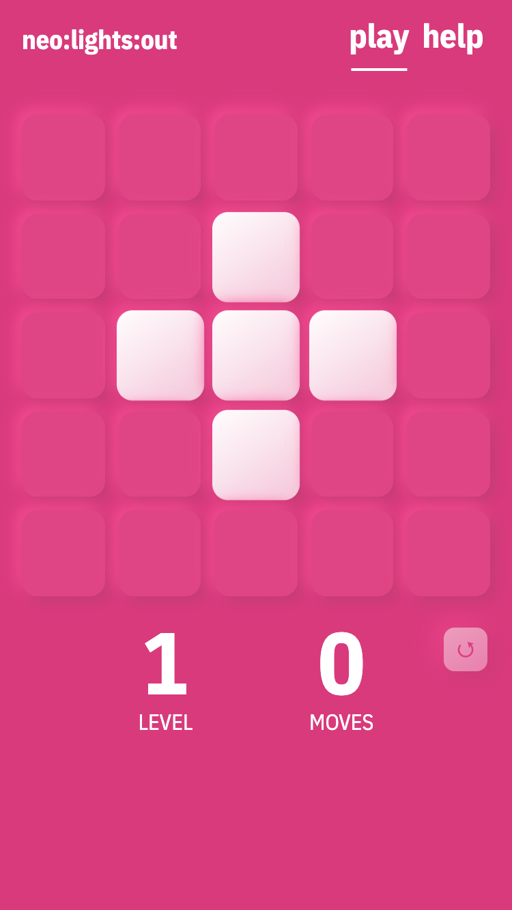

When I was a kid, I **loved** to play a game called Lights Out by Tiger Electronics.

It was my first portable "game console", and this is what it looked like:
<a href="https://www.youtube.com/embed/pj0lVmhkx7M" target="_blank">Lights out Commercial on YouTube →</a> (*Oh my, this commercial is gold!*)

Recently a similar grid pattern reminded me of this game, so I decided to recreate it – but as a progressive web app.

While I'm not a big fan of the Neomorphism design trend, I wanted to play around with it to get an idea how the gradients and shadows are combined for that special look.

Stuff I used for this project:
- Svelte with ~~Sapper~~, which I highly enjoyed using _(upgraded to SvelteKit in the meantime)_
- Default Sapper Service Worker to enable offline mode
- CSS Grid, because – well – it's a grid!
- This handy [Neumorphism Generator](https://neumorphism.io)
- This [ancient Lights Out implementation](https://www.jaapsch.net/puzzles/javascript/lightjcl.htm) where I could copy the levels from
- [Figma](https://www.figma.com) for the favicon and other images
- [Netlify](https://www.netlify.com) for hosting the statically exported app, thanks so much!

