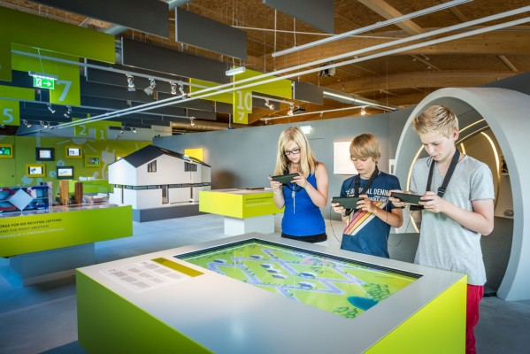

For the new science center for renewable energy <i>Sonnenwelt</i> in Großschönau, Austria I developed a multitouch application for the final stage of the interactive journey through the center.

During their visit, visitors can collect items and play games to learn more about energy usage in our daily lifes on a mobile guide.

At the end of the visit the customized house gets transfered to a 55 inch multitouch table showing a growing village. By choosing a good spot and correct alignment for the house visitors earn additional points for saving energy.

Every day a different village gets created depending on how and where visitors decide to place their houses.

## Context

This application was developed as a subcontractor to <i>St. Pölten University of Applied Sciences</i> in collaboration with Christoph Weis.

(Klaus Pichler)
