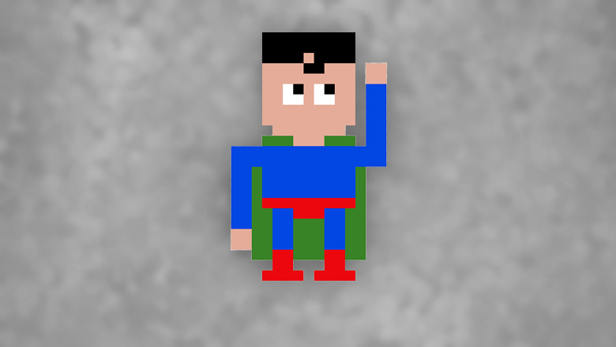
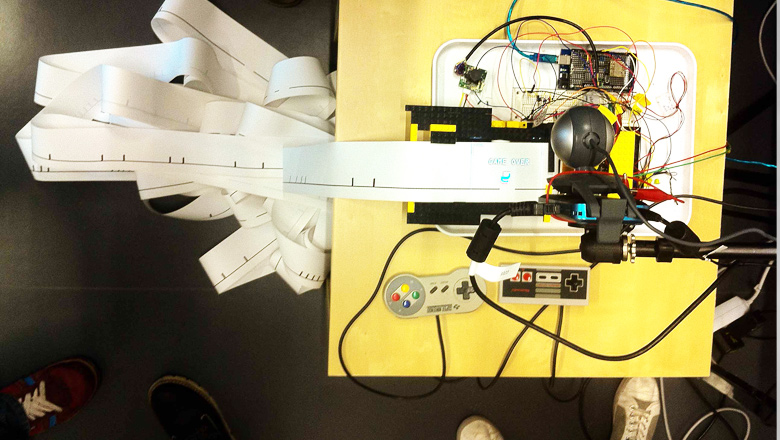
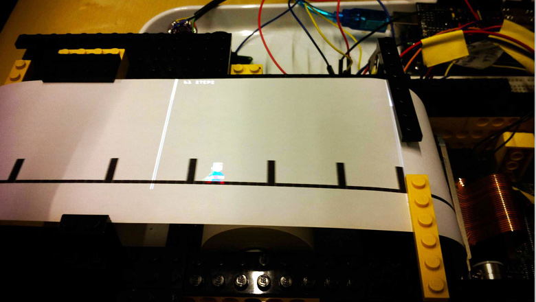
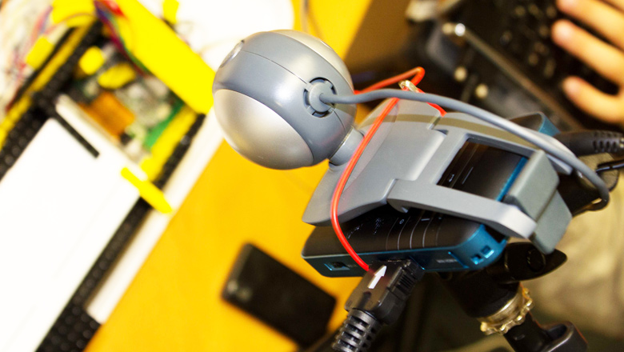
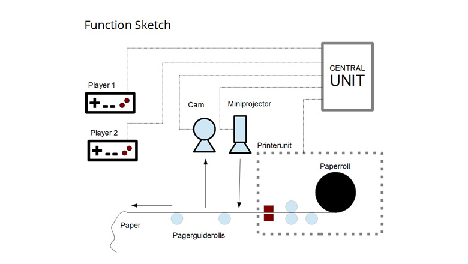

For an assignment for the course Interaction Design at St. Pölten University of Applied Sciences we created a litte game that combines physical level design and a digital, projected avatar.

Player 1 uses a physical controller to print the level that Player 2 has to play in real time.

The printing is done using a thermoprinter. As this represented a quick and dirty prototype we used a camera and OpenCV to detect the created level.

As you can see in the [video](https://vimeo.com/43594944), it was great fun to play, while at the same time it's not exactly what you would call eco-friendly...

## Team
Christian Munk, Daniel Werndl, Guilia Raberger, Martin Grubinger. A project of [Progressive Factory](http://www.progressivefactory.com/).

