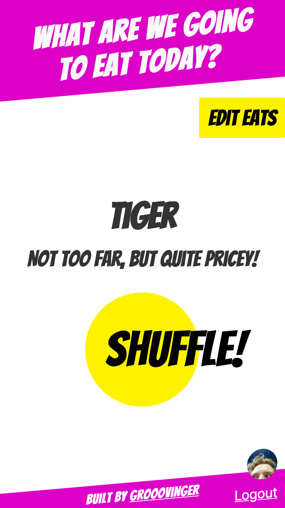

Every day at around noon we face the same problem at the [Fluxguide](https://www.fluxguide.com) office: **What are we going to eat today?**

Because of that, and, more importantly, because I really wanted to build something using [Svelte](https://svelte.dev), I decided to build *an app for that*.

Using *What are we going to eat today?* you can add all the possible things you can get for lunch (along with price and distance information) and then hit that bigass yellow button. Using Artificial Intelligence on a Blockchain and AR, the app decides to read your mind and suggest what you should get for lunch today.

(Ok, actually it is simply a simple dumb randomizing function.)

> This app has been retired in the meantime.

<iframe width="177" height="315" src="https://www.youtube.com/embed/ONdeBfgvK8E?rel=0&controls=0&showinfo=0&autoplay=1&fs=0&modestbranding=1&showinfo=0" frameborder="0" allow="accelerometer; autoplay; encrypted-media; gyroscope; picture-in-picture" allowfullscreen></iframe>

---

**Tech:** I used svelte to build the app, which was really easy to get started with. I especially like how many things are already baked in (transition, stores, settings tags in the `<head>` of your document, to name just a few) and still it's very simple to use.

For storing data as well as authentication, I used Google Firebase. It was quite easy to set up and use in a svelte app. Unfortunately I only discovered late in the process that it adds around 500kb to my Javascript-bundle. Uarg! Since this is just a fun side-project, I did not bother to implement an other data storing and auth solution.

The app was hosted on [Netlify](https://netlify.com/), of course.

