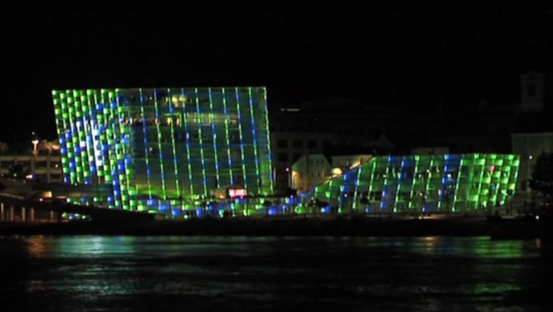
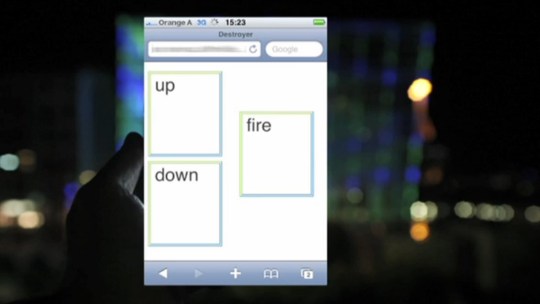

As a team of five students, we were invited to create a piece of interactive art using the facade of the Ars Electronica Center in Linz. For a couple of hours during the Ars Electronica 2009 visitors were able to play games and control visuals on the 38.500 LEDs of the 5.100 square meters large facade of the Center using smartphones.

To get a better impression, please watch the [video](https://vimeo.com/7069001).

## Team:
Blumenstein Kerstin, Eitler Thomas, Grubinger Martin, Kuba Roman, Maurice Wohlkönig

## Awards
This project was awarded the Golden Wire 2009.

